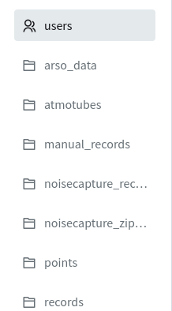
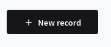
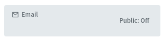
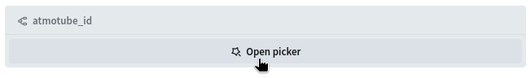
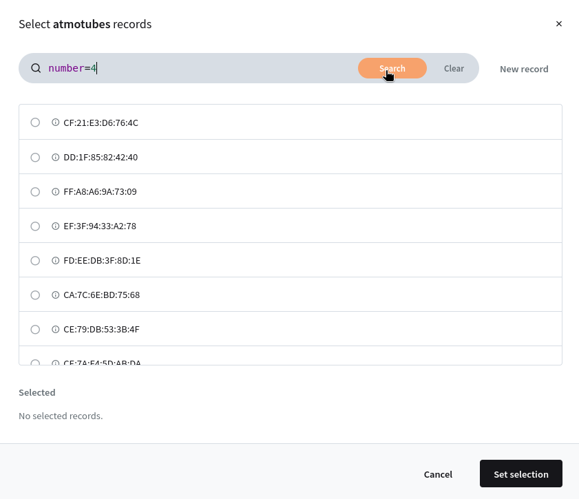
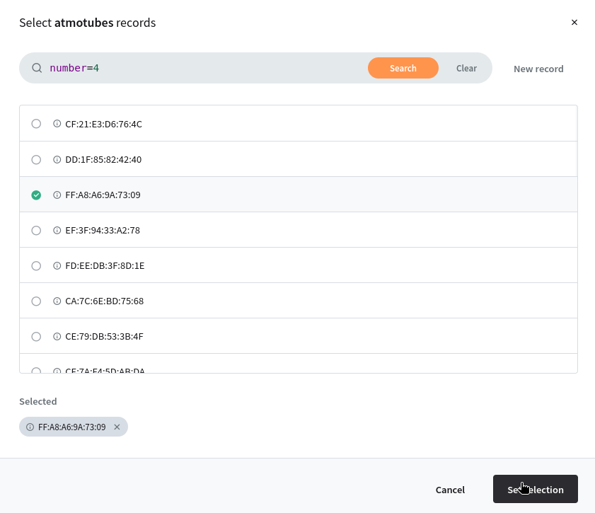

# Dodajanje novega uporabnika
1. Poveži se na ijs omrežje ali vpn

2. Odpri spletno stran [http://shiny.ijs.si:8090/_/](http://shiny.ijs.si:8090/_/)
in se prijavi

3. Na levi strani izberi colleciton *users* 

4. Desno zgoraj klikni na črn gumb *New record* 

5. Vpiši njegov e-mail naslov (ni potrebno, da je dejanski naslov, mora pa biti 
oblike: *besedilo@besedilo.besedilo* 

6. Vpiši geslo in ga potrdi
7. **NUJNO** potrdi polje verified (mora biti **zelene** barve) 

8. Podrsaj navzdol in v polju *atmotube_id* klikni *Open picker* 

9. V oknu, ki se pokaže izberi id atmotuba, ki ga bo imel uporabnik. V zgornji 
vrstici je omogočeno iskanje, najbolj uporabno v formatu: `number=4`, kjer je
4 interna številka atmoutba. Po tem ko vpišeš pritisni oranžen *search* gumb.

10. Klikni na izbrani atmotube, da ga označiš in nato na črn *Set selection* gumb 

11. Če veš že več informacij, jih lahko dodaš v ustrezno polje

12. Pritisni črn gumb *Create* desno spodaj.

