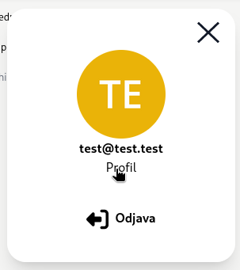
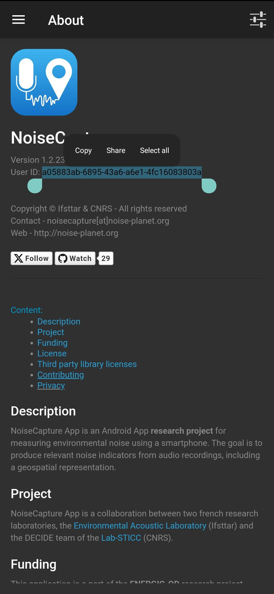

# Navodila za uporabo primerjalnika poti

## Prva prijava
1. Odpri link, ki si ga dobil v mail-u skupaj s podatki za prijavo.
2. V prvo okence (Email) vpiši uporabniško ime, v drugega (Geslo) geslo in nato oranžen
gumb *Prijava*
3. Klikni na oranžen krog desno zgoraj. Odprlo se bo podokno, v katerem klikni 
na napis *Profil*.

4. V profilu vpiši svoje podatke (noise capture id, višina, teža, starost, spol)
Predvsem je pomemben noise capture id. Tega najdeš v noisecapture aplikaciji 
(desno zgoraj tri črtice - izber *About*, potem kopiraj User ID).

5. Pritisni na rumen gumb *Shrani*.

## Pregled meritev
1. Levo zgoraj klikni na gumb *Meritve*. Odprlo se bo okno s preteklimi 
meritvami. Prikazali se bodo samo posnetki, kjer so na voljo vsi podatki iz
NoiseCapture aplikacije in Atmotube naprave (če vmes manjka podatek za vsaj eno
minuto, se posnetek ne bo pojavil) in je posnetek dolg vsaj 2 minuti.

2. Za vsak posnetek:
    - Če je med njimi kakšen, ki za to raziskavo ni 
    pomemben, ga označi kot zasebnega (odkljukaj *Zaseben posnetek*)
    - Če pot ni pravilno označena (Originalna/Alternativna), to popravi s klikom na
    Originalna/Alternativna in izbiro prave možnosti.

3. S klikom na zemljevid posnetka, se bo odprlo okno s podrobnostmi. Tam lahko 
spodaj preveriš graf, na katerem so prikazani: hrup, delci (pm1,pm2.5, pm10), 
vlaga in temperatura. Če podatka o temperaturi ali vlagi za neko minuto ni, ta 
podatek ne bo prikazan.

## Pregled podatkov iz Atmotuba in NoiseCapture aplikacije
Primerjalnik poti deluje tako, da iz Atmotube naprave oziroma NoiseCapture 
aplikacije dobiva iz Atmotube oziroma NoiseCapture serverja. Podatke pobira 
vsakih 10 minut. Zaradi tega ni nujno, da bodo podatki, ki so vidni v Atmotube
oziroma NoiseCapture aplikaciji takoj vidni tudi v Primerjalniku poti. Podatke
iz NoiseCaputre in Atmotube Serverjev pa lahko pregledaš v zavihkih *Noise* in 
*Atm*.

### Atmotube: 
1. Levo zgoraj klikni na gumb *Atm* 
2. V polju za izbiro datuma vpiši dan za katerega te podatki zanimajo. 
3. S klikom na gumb *potrdi* potrdi izbiro. Če so podatki za tisti dan na voljo,
se bodo prikazali od 00:00 zjutraj do 00:00 zvečer tistega dne, po UTC času.

### NoiseCapture: 
1. Levo zgoraj klikni na gumb *Noise* 
2. Zapisali se bodo vsi posnetki iz NoiseCapture serverja. Preneseš jih lahko s 
klikom na gumb *prenesi*.

## Pregled rezultatov raziskave
1. Levo zgoraj klikni na gumb *Rezultati*. 
